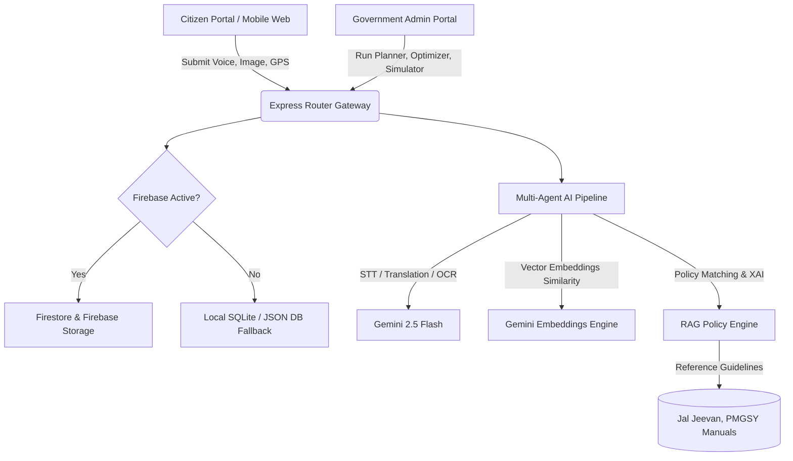
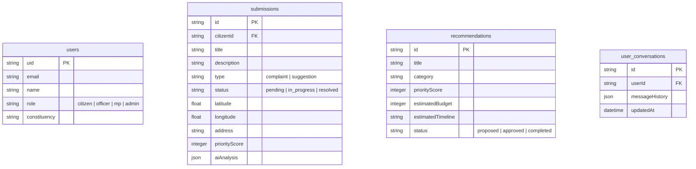

# JanSetu (People's Priorities)
### AI-Powered Constituency Development & Grievance Orchestration Platform


---

## 🏛️ Executive Summary & Problem Statement
Constituency development is often hindered by fragmented communication, offline manual backlogs, lack of explainability in priority decisions, and slow municipal allocations. Representatives (MPs/MLAs) struggle to evaluate thousands of localized demands without structural tools.

**JanSetu** is an enterprise-grade Digital India platform that bridges this gap. It allows citizens to log local issues in regional languages (Hindi, Bengali, Tamil) via text, audio recordings, or photo uploads, geotagging their exact GPS coordinate bounds. A backend **Multi-Agent Generative AI pipeline** powered by Google Gemini 2.5 translates local feedback, scans images via OCR, filters duplicates using cosine vector similarity, evaluates priority and confidence weights, matches grievances to central government schemes (Jal Jeevan, PMGSY), recommends budget allocations, and presents representatives with interactive "What-If" simulators.

---

## 🛰️ Tech Stack
- **Frontend Core**: React 18, TypeScript, Tailwind CSS, Lucide icons
- **GIS Mapping**: Leaflet, ESRI Satellite Tiles, OpenTopoMap terrain layers
- **Charting**: Recharts responsive area/bar/pie widgets
- **Backend Core**: Node.js, Express, TypeScript
- **Database & Storage**: Firebase Auth, Firestore, Firebase Storage (*with a fully functional SQLite & local-JSON file fallback if Firebase is offline*)
- **AI Core**: Gemini 2.5 Pro & Flash, Gemini text-embeddings-004

---

## 📐 System Architecture Diagram


---

## 🗄️ Database Entity Schema (ER)


---

## 🔌 API Documentation

### 1. Grievance Submissions
- `POST /api/submissions` - Create a citizen grievance. Supports multipart form data (photo, audio, coordinates).
- `PATCH /api/submissions/:id/status` - District Nodal Officer assigns department or resolves complaint.
- `POST /api/submissions/simulate-complaint` - Simulated complaint poster for demo mode.

### 2. Generative AI & Planning Suite
- `POST /api/ai/priority-report` - Generate XAI priority explainability dials for a grievance.
- `POST /api/ai/budget-optimize` - Allocate budgets across categories using cost-benefit optimization.
- `POST /api/ai/planner` - Suggest development projects, phases, and schedules.
- `POST /api/ai/simulate` - "What-If" scenario simulator.
- `GET /api/ai/predict` - Forecast municipal risks (flood, shortage, electricity).
- `GET /api/ai/gov-data` - Pull IMD weather forecasts, NFHS health data, and CPCB Air Quality profiles.

### 3. Bharat AI Assistant
- `POST /api/chat` - Feed message and history context for conversational Gemini RAG.
- `GET /api/chat/history` - Retrieve authenticated session conversation history logs.

---

## 🚀 Deployment Guide

### Prerequisites
- Node.js (v18+)
- npm

### 1. Clone & Install Dependencies
```bash
# Clone the repository
cd JanSetu

# Install backend dependencies
cd backend
npm install

# Install frontend dependencies
cd ../frontend
npm install
```

### 2. Configure Environment Variables
Create a `.env` file under `/backend`:
```env
PORT=5000
GEMINI_API_KEY=your_gemini_api_key
# To run in SQLite / Local Fallback mode:
USE_LOCAL_FALLBACK=true
```

### 3. Seed Mock Database Records
```bash
cd backend
npm run seed
```

### 4. Run Development Servers
```bash
# Start Backend
cd backend
npm run dev

# Start Frontend (in separate terminal)
cd frontend
npm run dev
```
Open `http://localhost:5173` to interact with the platform.

---

## 🏛️ Judge Demo Script (Walkthrough)

1. **Step 1: The Landing Page**
   - Click "Open Judge Panel" at the bottom helper card.
   - Observe the Digital India design theme, saffron lines, and the spinning Ashoka Chakra.
2. **Step 2: Triggering One-Click Walkthrough**
   - Click the **"Run Complete Demo"** button on the Judge Panel.
   - Watch the state machine mutate actual data:
     - Logins as citizen.
     - Creates simulated complaint with GPS coordinates.
     - Runs Gemini translations, OCR readings, and priority dials.
     - Matches duplicate reports using vector similarity.
     - Assigns department SLA routes.
     - Allocates MPLADS funds and updates the Government Analytics board.
3. **Step 3: JanSetu AI Assistant**
   - Navigate to **JanSetu AI Assistant**. Click the microphone icon to input voice prompts.
   - Click the "Listen Response" button to hear Gemini's answer dictated out loud.
   - Click "Export PDF Draft" to generate styled printable document summaries.
4. **Step 4: ArcGIS GIS map**
   - Open **Hotspot Map**. Toggle between ESRI Satellite and OpenTopoMap terrain layers.
   - Select a marker pin to inspect live IMD weather reports, CPCB indices, and NFHS statistics.
5. **Step 5: Scenario Simulator**
   - Navigate to **What-If Simulator**. Adjust the sliders to build schools or roads and download print-ready impact guides.

---

## 📈 Social Impact & Scalability
- **Empowering Remote Communities**: Native voice transcription translates local feedback to official English instantly.
- **Explainable Decisions**: Explainable AI slider weights ensure funds are allocated transparently based on objective parameters (SDGs, safety gaps) rather than administrative bias.
- **Resource Optimization**: Scenario planning tools help local leaders simulate long-term welfare results prior to allocating budget capital.
